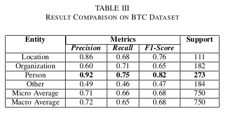
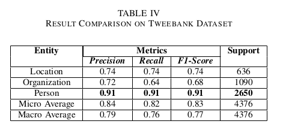

This repo provides the source code of our experiments on finetuning pre-
trained models for NER task using T-NER, a Python framework
for assisting researchers in finetuning NER pre-trained models. We tested the pre-trained and fine-tuned models on two datasets, namely BTC and Tweebank datasets. 

We replicated the experiment that is done by the creators of
T-NER in an environment with less resources. The experiment
was evaluated using commonly used metrics such as precision,
recall, and F1 score. The result shows only a slight decrease
of performance in the replicate experiment despite a huge gap
of resources used. The result of the experiment can be seen in the images below.

